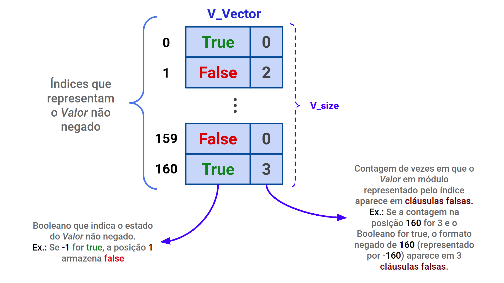
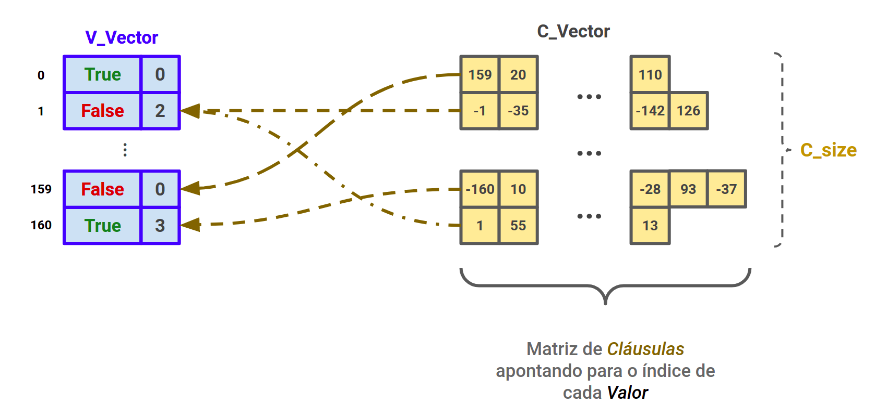
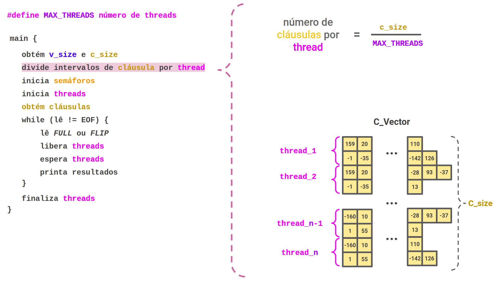
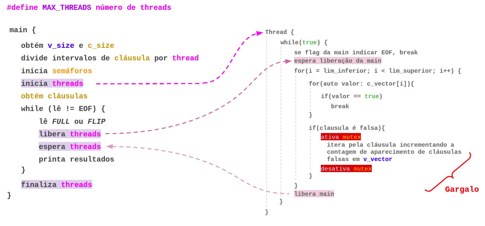
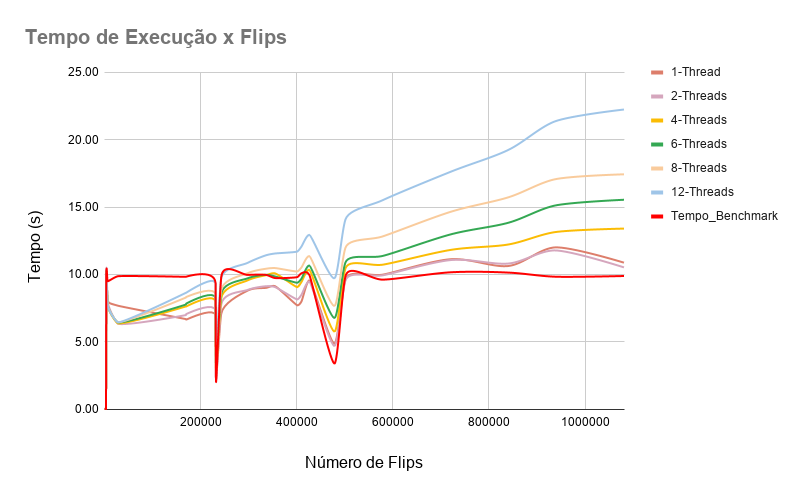
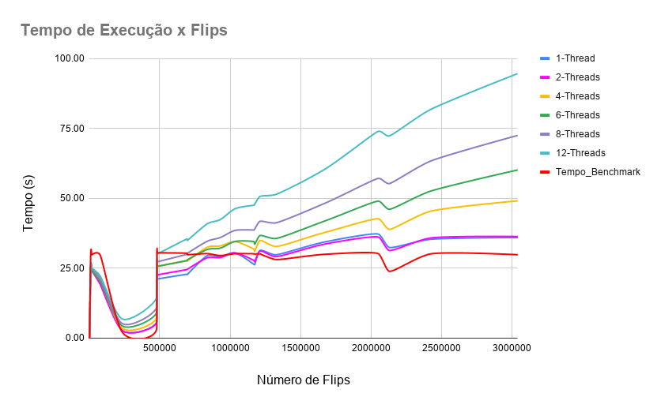
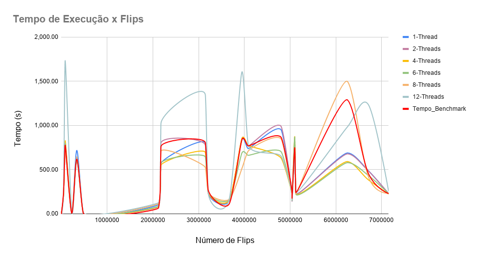
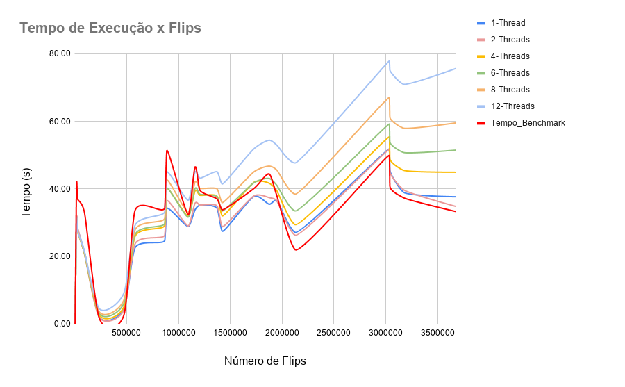
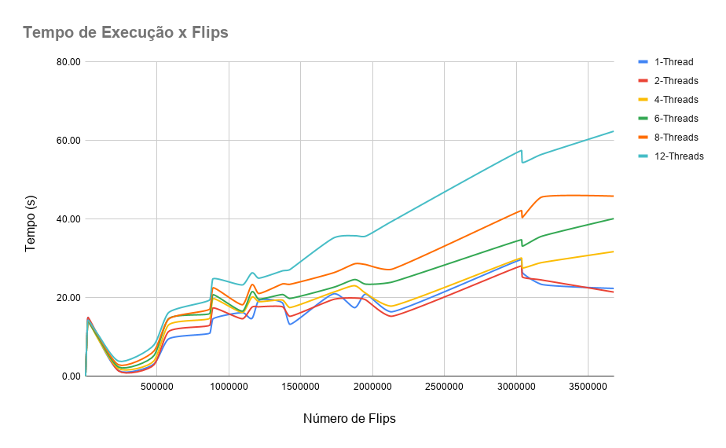

# **SAT**

## **Dados**

| **Aluno** | **Matrícula** |
| --- | --- |
| Alexandre Miguel Rodrigues Nunes Pereira | 16/0000840 |
| Rômulo Vinícius de Souza | 15/0147601 |

## **Introdução**

Esse projeto busca solucionar o problema do algoritmo de ***Verificador de Valoração***, em que o programa recebe um conjunto de cláusulas valoração para as variáveis de uma fórmula, bem como diversos comandos que alteram o estado das variáveis, tendo como objetivo verificar se as valorações satisfazem as fórmulas de cada cláusula, imprimindo dados a respeito das cláusulas não satisfeitas, como o índice dessas cláusulas e a quantidade de variáveis falsas em uma valoração não satisfeita. Os detalhes do problema formulado podem ser obtidos em [https://www.brunoribas.com.br/pspd/2020-2/](https://www.brunoribas.com.br/pspd/2020-2/).

## **Execução**

```bash
# Entre na pasta do programa que contém o Makefile
$ cd pspd-SAT/

# Para compilar o programa, basta utilizar o make
$ make

# O programa ficará esperando o input, no formato do arquivo input_simples
$ make run
```


## **Código**

Os diagramas a seguir trazem uma representação dos códigos do arquivo ```main.cpp```

### **Vetor de Variáveis**

Para armazenar o estado booleano das variáveis não negadas e a contagem de aparecimento de cada variável em cláusulas falsas, respectivamente, a estrutura utilizada consiste em um vetor de par (booleano e inteiro).



### **Matriz de Cláusulas**

Para armazenar as cláusulas obtidas, a estrutura utilizada consiste em uma matriz, criada dinâmicamente, em que cada linha armazena uma cláusula e cada coluna armazena a variável na cláusula, seja em seu formato negado ou não.



### **Divisão por Threads**

A abordagem de utilização de threads no projeto ocorre ao separar um conjunto de cláusulas pelo qual cada thread ficará responsável, executando as valorações de forma paralela para esses subconjuntos.



### **Flip e Full**

Para a abordagem dos comandos de **Flip** e **Full** recebidos pelo programa, a seguinte estratégia foi estabelecida: para comandos **Flip** ocorre um acesso direto para alterar a variável booleana do vetor de variáveis; para comandos **Full** o vetor de variáveis é inteiramente limpo e os novos estados das variáveis são inseridos um a um.


### **Estrutura das Threads**

As threads utilizam uma abordagem análoga à de ```produtor-consumidor```, com o uso de semáforos para que cada thread seja criada uma única vez e seu processamento seja executado apenas mediante liberação a partir da thread principal. 



## **Resultados**

Os seguintes gráficos trazem os resultados obtidos ao se executar o programa com arquivos de exemplo gerado pelo comando ```make``` com Time Limits de 10, 30, 60 e 120 segundos, além de versões de teste com os arquivos de exemplo com Time Limit de 60 segundos com a escrita do programa direcionada para ```/dev/null``` e com a região de escrita comentada.

### **Time Limit - 10 segundos**

A seguinte tabela representa o tempo total de execução do conjunto de testes obtido por versão do programa.

| Arquivo | Tempo Total (s) |
| --- | --- |
| Benchmark  | 192.57 |
| 1-Thread   | 175.90 |
| 2-Threads  | 177.40 |
| 4-Threads  | 194.36 |
| 6-Threads  | 205.65 |
| 8-Threads  | 222.41 |
| 12-Threads | 255.65 |

O Seguinte gráfico representa a execução dos arquivos de teste gerados com um Time Limit de 10 segundos, podendo ser acessado de forma iterativa no seguinte link: [Gráfico Interativo](https://docs.google.com/spreadsheets/d/e/2PACX-1vQ9QhhNrcb-rOy9qFRbwgrXh6ybKQkv5ldzReMxIkzMXJS-j8zbgFYzeQlLD23sLadZoxWqxU7Pekg7/pubchart?oid=1992445255&format=interactive).




### **Time Limit - 30 segundos**

A seguinte tabela representa o tempo total de execução do conjunto de testes obtido por versão do programa.

| Arquivo | Tempo Total (s) |
| --- | --- |
| Benchmark  | 568.46 |
| 1-Thread   | 541.81 |
| 2-Threads  | 546.18 |
| 4-Threads  | 631.97 |
| 6-Threads  | 677.94 |
| 8-Threads  | 768.19 |
| 12-Threads | 934.26 |

O Seguinte gráfico representa a execução dos arquivos de teste gerados com um Time Limit de 30 segundos, podendo ser acessado de forma iterativa no seguinte link: [Gráfico Interativo](https://docs.google.com/spreadsheets/d/e/2PACX-1vSSDv6ceB_wIyGu26Tq7JIQ9lXM6c4gvrQXuL0vWl2o4c-GelCcPI2WAfrsB2UC3S85AOEWZnfjGkGj/pubchart?oid=2088872719&format=interactive).




### **Time Limit - 60 segundos**

A seguinte tabela representa o tempo total de execução do conjunto de testes obtido por versão do programa.

| Arquivo | Tempo Total (s) |
| --- | --- |
| Benchmark  | 741.54 |
| 1-Thread   | 653.43 |
| 2-Threads  | 662.84 |
| 4-Threads  | 722.21 |
| 6-Threads  | 758.82 |
| 8-Threads  | 825.70 |
| 12-Threads | 933.44 |

O Seguinte gráfico representa a execução dos arquivos de teste gerados com um Time Limit de 60 segundos, podendo ser acessado de forma iterativa no seguinte link: [Gráfico Interativo](https://docs.google.com/spreadsheets/d/e/2PACX-1vTjRnD25_BMiOIfO5ESgla_JNhZVnl_MzasK1CWjzPfdRyFr4NavMuOxaOUCNN_-tX_JU5vtnotTusV/pubchart?oid=1673320664&format=interactive)
.


### Time Limit - 120 segundos

A seguinte tabela representa o tempo total de execução do conjunto de testes obtido por versão do programa.

| Arquivo | Tempo Total (s) |
| --- | --- |
| Benchmark | 9817.26 |
| 1-Thread | 9116.17 |
| 2-Threads | 9145.39 |
| 4-Threads | 8589.33 |
| 6-Threads | 8340.82 |
| 8-Threads | 9095.08 |
| 12-Threads | 12612.00 |

O Seguinte gráfico representa a execução dos arquivos de teste gerados com um Time Limit de 120 segundos, podendo ser acessado de forma iterativa no seguinte link: [Gráfico Interativo](https://docs.google.com/spreadsheets/d/e/2PACX-1vQ4LW32hiUP5L6SGqvQs0o4oFo4jVcB2lthy84eCTYvxm6nV-08DibE5io7T3LzlR99_K3xGjv5gKg3/pubchart?oid=475898983&format=interactive).




### Output para /dev/null - 60 segundos

A seguinte tabela representa o tempo total de execução do conjunto de testes obtido por versão do programa.

| Arquivo | Tempo Total (s) |
| --- | --- |
| Benchmark  | 731.78 |
| 1-Thread   | 640.00 |
| 2-Threads  | 647.45 |
| 4-Threads  | 708.92 |
| 6-Threads  | 741.89 |
| 8-Threads  | 805.78 |
| 12-Threads | 919.96 |

O Seguinte gráfico representa a execução dos arquivos de teste gerados com um Time Limit de 60 segundos e os prints para ```/dev/null```, podendo ser acessado de forma iterativa no seguinte link: [Gráfico Interativo](https://docs.google.com/spreadsheets/d/e/2PACX-1vTjRnD25_BMiOIfO5ESgla_JNhZVnl_MzasK1CWjzPfdRyFr4NavMuOxaOUCNN_-tX_JU5vtnotTusV/pubchart?oid=1933028394&format=i/dev/null).



### Prints comentados - 60 segundos

O Seguinte gráfico representa a execução dos arquivos de teste gerados com um Time Limit de 60 segundos e os prints comentados, podendo ser acessado de forma iterativa no seguinte link: [Gráfico Interativo](https://docs.google.com/spreadsheets/d/e/2PACX-1vTjRnD25_BMiOIfO5ESgla_JNhZVnl_MzasK1CWjzPfdRyFr4NavMuOxaOUCNN_-tX_JU5vtnotTusV/pubchart?oid=829797197&format=interactive).



## **Conclusão**

Para realizar a análise dos gráficos obtidos, é necessário ter em mente que o problema avaliado depende de uma grande quantidade de variáveis, como **Número de Cláusulas, Número de Variáveis, Número de Flips e Número de Fulls**, além da quantidade de threads com que o programa é executado e a disponibilidade de processadores da máquina em que se executa. Apesar dessas variáveis, pode-se observar que o tempo total de execução de conjunto de testes apresenta ainda dados favoráveis à implementação em questão.


Assim, foi possível notar que os gargalos do programa em relação à implementação sequencial se dão principalmente pela iteração por vetores de forma sequencial, seja ao se apagar e preencher novamente o *Vetor de variáveis*, ou a região crítica de acesso concorrente das threads que itera pelos elementos da cláusula, atualizando a contagem de variáveis em cláusulas falsas enquanto impede que múltiplos acessos de escrita ocorrem nos elementos desse vetor. O tempo de leitura dos dados, por sua vez, teve uma baixa expressividade em relação ao tempo total de execução, como pode ser observado pela tabela abaixo:

|Time Limit |  Percentual do Tempo Total (%) |
| --- | --- |
| 10 | 0,45 |
| 30 | 0,4 | 
| 60 | 0,34| 
| 120 | 0,036 | 


Portanto, pode-se concluir que, embora o código não apresente uma estrutura que tire vantagem performática do aumento expressivo da quantidade de comandos **Full** - visto que os gráficos explicitam perda de desempenho nesse contexto em relação à implementação de *Benchmark* - a estrutura do código busca tirar vantagem de casos de teste com uma extensa quantidade de testes e de variáveis, ou ainda com uma quantidade maior de comandos **Flip**.

